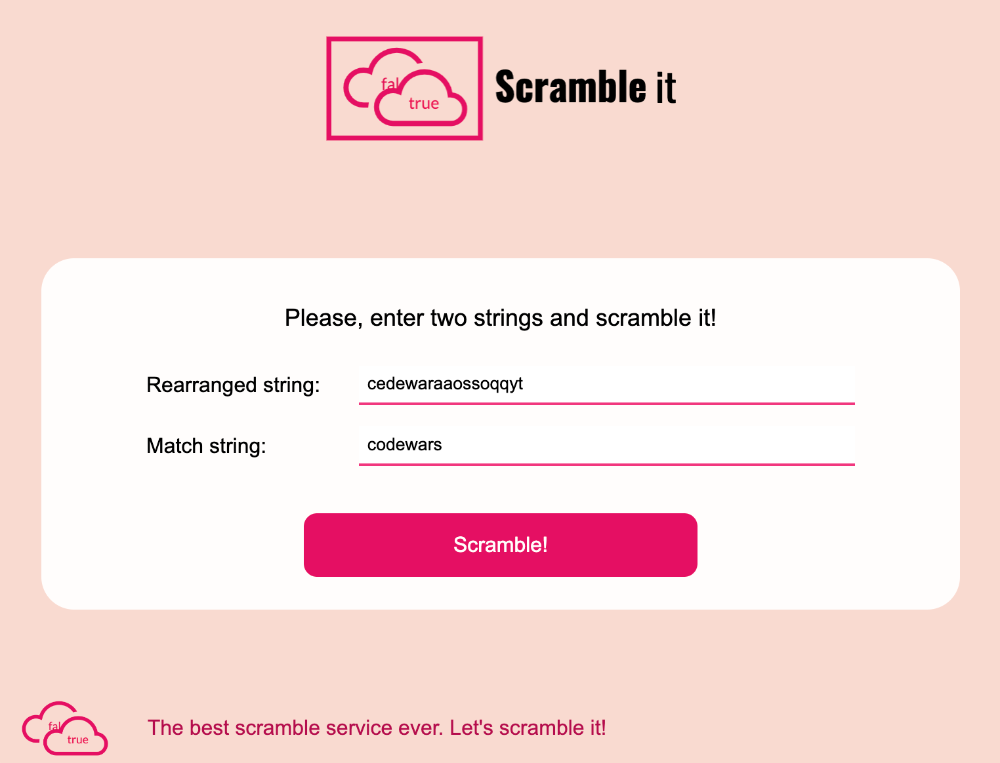
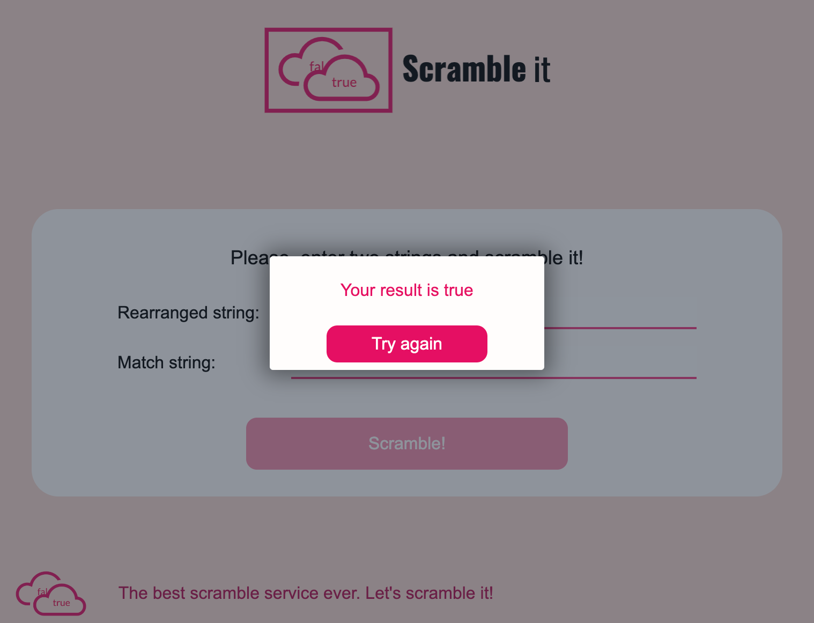

# Scramble SPA

Simple SPA written on clojure (ring + compojure) and clojurescript (reagent). 
The project is compiled into one uberjar with lein and shadow-cljs. 

## Installation

To compile uberjar please use

```bash
$ lein uberjar
```

To clean temporary output folders ("target" and "resources/public/js"):

```bash
$ lein clean
```

To run the application use in console:

```bash
$ java -jar target/uberjar/flexiana.jar
```

## Usage

1. Open in browser http://localhost:4000/

2. In the first input enter the rearranged string.

3. In the second - the match string.

4. Then press 'Scramble' button.

If a portion of the first characters can be rearranged to match second string - returns true, otherwise returns false.

## Examples





## License

Copyright © 2022 

This program and the accompanying materials are made available under the
terms of the Eclipse Public License 2.0 which is available at
http://www.eclipse.org/legal/epl-2.0.

This Source Code may also be made available under the following Secondary
Licenses when the conditions for such availability set forth in the Eclipse
Public License, v. 2.0 are satisfied: GNU General Public License as published by
the Free Software Foundation, either version 2 of the License, or (at your
option) any later version, with the GNU Classpath Exception which is available
at https://www.gnu.org/software/classpath/license.html.
